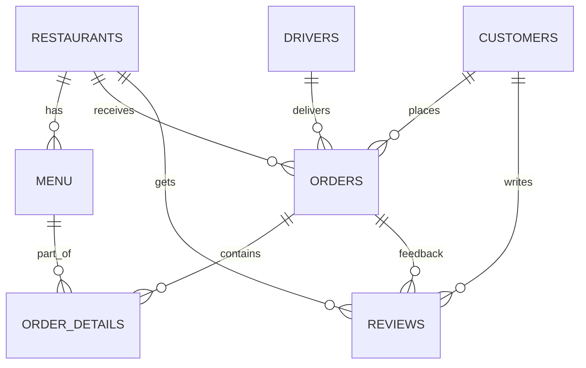

# 🍽️ Hunger Express – Food Delivery Database

 📌 Project Overview

Hunger Express is a relational database project that simulates a real-world food delivery system (similar to Swiggy/Zomato).
It demonstrates database design, constraints, and advanced SQL queries to extract business insights.

---

 🛠️ Tech Stack

 Database: MySQL
 Concepts: Normalization, Constraints (PK, FK, CHECK, UNIQUE), Joins, CTEs, Window Functions, Aggregations

---

 📂 Database Schema

The project includes the following tables:

| Table              | Description                                                              |
| ------------------ | ------------------------------------------------------------------------ |
| Restaurants    | Stores restaurant details with average rating (calculated from reviews). |
| Menu           | Contains dishes, categories, and prices for each restaurant.             |
| Customers      | Manages customer info and join dates.                                    |
| Drivers        | Delivery driver details including vehicle type.                          |
| Orders         | Customer orders with payment info, linked to drivers & restaurants.      |
| Order\_Details | Breaks down each order into menu items & quantities.                     |
| Reviews        | Ratings & reviews from customers for restaurants.                        |

---

 🗂️ ER Diagram


 




---

 🔑 Key Features

 ✅ Constraints: PK, FK (`ON DELETE CASCADE`), UNIQUE & CHECK.
 ✅ Data Integrity across restaurants, menus, orders, and reviews.
 ✅ Analytical Queries:

   Top-rated restaurants ⭐
   Fastest drivers 🏍️
   Most ordered dishes 🍕
   Customer order history 📜

---

 📊 Example Query – Fastest Delivery Driver

```sql
WITH AVERAGE_DELIVERY_TIME AS (
    SELECT 
        D.NAME AS DRIVER_NAME,
        ROUND(AVG(O.DELIVERY_TIME_MINUTES), 2) AS AVG_DELIVERY_TIME,
        RANK() OVER (ORDER BY ROUND(AVG(O.DELIVERY_TIME_MINUTES), 2)) AS RNK
    FROM DRIVERS D
    JOIN ORDERS O
        ON D.DRIVER_ID = O.DRIVER_ID
    GROUP BY D.NAME
)
SELECT DRIVER_NAME, AVG_DELIVERY_TIME
FROM AVERAGE_DELIVERY_TIME
WHERE RNK = 1;
```

---

 🚀 How to Run

1. Clone this repo:

   ```bash
   git clone https://github.com/yourusername/Food_Delivery_Analysis-using-SQL.git
   Food_Delivery_Analysis-using-SQL
   ```
2. Import schema:

   ```sql
   source create_tables.sql;
   ```
3. Insert sample data:

   ```sql
   source insert_data.sql;
   ```
4. Run queries:

   ```sql
   source queries.sql;
   ```

---

 📌 Future Enhancements

 Add a Payments Table with transaction details.
 Implement Stored Procedures & Triggers.
 Build a Power BI/Tableau dashboard.
 Extend with real-time delivery tracking.

---

 👨‍💻 Author

Developed by Arka Bhowmik

💼 Connect on [LinkedIn][Arka Bhowmik](https://www.linkedin.com/in/arka-bhowmik-a721a619a/)
---
